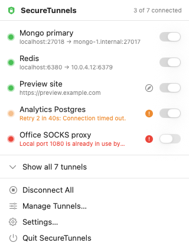
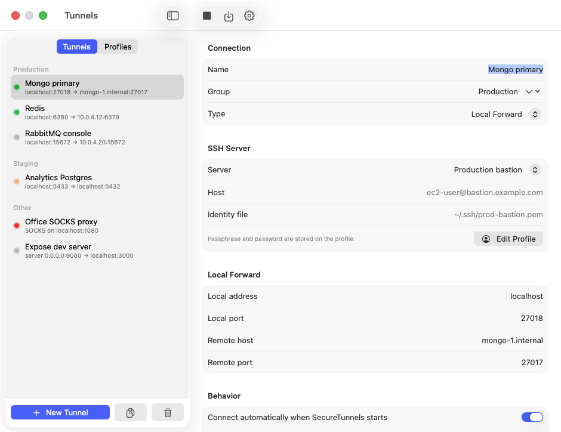

<p align="center">
  
</p>

# SecureTunnels

SSH tunnels from the macOS menu bar. SecureTunnels replaces the unmaintained Secure Pipes: it runs
`/usr/bin/ssh` for you, keeps the tunnels alive, and imports your existing Secure Pipes connections.

<p align="center">
  
</p>

<p align="center">
  
</p>

## What it does

- Lists every tunnel in a menu bar popover with a live status dot and a switch to connect or disconnect.
  Tunnels can be grouped (Production, Staging, a client name) and each group connects or disconnects as one.
- Local forwards, remote forwards and SOCKS proxies.
- Profiles bundle a server: host, port, username, identity file, key passphrase and password. Several tunnels
  can share one profile, or a tunnel can carry its own settings. Secrets live in the login keychain, not on
  disk.
- Connects selected tunnels when the app starts, and starts the app at login.
- Reconnects after a drop with exponential backoff (the tunnel's interval, then double each time, capped at
  five minutes, never giving up), after the Mac wakes from sleep, and immediately when the network comes back.
- Checks the local port before connecting and names the process that holds it, so a clash with another tool
  shows up as "port 8080 is already in use by ssh (pid 1914)" instead of a failed handshake.
- Shows why a connection failed: a plain-language error in the popover, and the ssh output of the last attempt
  in the tunnel editor with a Copy button.
- Imports Secure Pipes connections on first launch and on demand from Settings. Passphrases and passwords are
  not carried over because Secure Pipes keeps them in its own keychain items, so enter them once per tunnel.
- Writes a per-tunnel ssh log under `~/Library/Application Support/SecureTunnels/logs`.

Requires macOS 14 or newer.

## Install

There is no notarized download yet, so macOS will refuse to open a copy you received as a zip until you clear
the quarantine flag. Either build it yourself or install a zip from a teammate.

### Build from source

You need Xcode 15 or newer (SwiftPM and XCTest come with it). No Xcode project is involved.

```bash
git clone https://github.com/natanavra/SecureTunnels.git
cd SecureTunnels
make install
```

`make install` compiles the release build, assembles `build/SecureTunnels.app`, ad-hoc signs it, copies it to
`/Applications` and launches it. The lock icon appears in the menu bar.

### Install from a zip

```bash
unzip SecureTunnels-1.0.0.zip -d /Applications
xattr -dr com.apple.quarantine /Applications/SecureTunnels.app
open /Applications/SecureTunnels.app
```

Without the `xattr` line Gatekeeper reports that the app is damaged or from an unidentified developer. The app
is ad-hoc signed because there is no Apple Developer ID behind it. Right-clicking the app and choosing Open
works too.

### First run

1. If Secure Pipes is installed, its connections are imported automatically. Otherwise open Manage Tunnels
   from the menu bar and press + to add one.
2. Open each tunnel and enter its key passphrase or password if it needs one.
3. Turn on "Launch SecureTunnels at login" in Settings. The app has to run from `/Applications` for macOS to
   accept it as a login item.
4. Quit Secure Pipes before connecting, otherwise the local ports are still taken. The tunnel editor warns
   when another process holds the port.
5. If several tunnels go through the same server, open one of them and press "Save as Profile", then pick that
   profile under "Server" in the others.

## Build targets

| Target             | What it does                                                        |
| ------------------ | ------------------------------------------------------------------- |
| `make build`       | Release build into `build/SecureTunnels.app`                        |
| `make debug`       | Same, debug configuration                                           |
| `make run`         | Build and open the app from the build folder                        |
| `make install`     | Build, copy to `/Applications` and launch                           |
| `make dist`        | Build and zip the app as `build/SecureTunnels-<version>.zip`        |
| `make test`        | Run the unit tests (`swift test`)                                   |
| `make screenshots` | Render the README screenshots with sample data, light and dark      |
| `make icon`        | Regenerate `Resources/AppIcon.icns` from `Resources/icon-source.png` |

Set `VERSION=0.2.0` to stamp a different version, and `CODESIGN_IDENTITY="Developer ID Application: ..."` to
sign with a real identity. With ad-hoc signing every rebuild is a new code identity, so macOS may ask once per
tunnel to allow the new build to read the stored secret. Choose "Always Allow", or sign with a stable identity.

The app also answers two command line flags, which the Makefile uses:

```bash
/Applications/SecureTunnels.app/Contents/MacOS/SecureTunnels --launch-at-login on|off|status
/Applications/SecureTunnels.app/Contents/MacOS/SecureTunnels --snapshot <dir> [--demo] [--dark]
```

## How a tunnel runs

Each tunnel is one `ssh -N` process with `ExitOnForwardFailure`, keep-alives and an app-owned `known_hosts`
file. The app treats the tunnel as connected when ssh's `LocalCommand` prints a marker, which is the only
reliable signal with `-N`.

Key passphrases and passwords are answered through `SSH_ASKPASS`. The app writes them to ssh's stdin as JSON
and the bundled `SecureTunnelsAskPass` helper reads them back when ssh asks. They never appear in arguments or
environment variables. Host keys of new servers are trusted on first connect (`accept-new`) unless strict
checking is enabled for the tunnel. A changed host key is always rejected.

When ssh exits while the tunnel should be up, the app waits the tunnel's reconnect interval and starts it
again, doubling the wait on each further failure up to five minutes. It keeps trying until you disconnect the
tunnel. When the network path goes away it kills the sessions immediately, shows "Waiting for network", and
relaunches them the moment a route is back, with the backoff reset. Before sleep it does the same and
reconnects three seconds after wake.

## Troubleshooting

**The tunnel switches off right after switching on.** Open Manage Tunnels, select the tunnel and read "Last
error" and the ssh output box in the Status section, or press Show Log. The usual causes:

- Another process already listens on the local port. The error names it, for example "port 8080 is already in
  use by node (pid 512)". Pick another local port or stop that process.
- The key needs a passphrase that has not been entered, or the key is not the right one for the server. ssh
  reports "Permission denied (publickey)". Enter the passphrase in the tunnel or profile, or add the key.
- The key file's permissions are too open. ssh ignores keys that other users can read: `chmod 600 key.pem`.
- The key lives in Desktop, Documents, Downloads or a cloud drive folder and macOS has not let SecureTunnels
  read it. Allow it under System Settings > Privacy & Security > Files and Folders, or move the key to `~/.ssh`.
- The app came from a zip and only the app itself was un-quarantined (right-click, Open). ssh runs the bundled
  passphrase helper directly and Gatekeeper kills it. The app clears the flag on the helper by itself when it
  can; otherwise run `xattr -dr com.apple.quarantine /Applications/SecureTunnels.app`.
- No route to the network. The popover header says "No network" and the tunnel waits instead of failing.

**Launch at login is off after a rebuild.** macOS ties the login item to the app at `/Applications`. Turn the
toggle off and on again in Settings after replacing the app.

## Layout

- `Sources/SecureTunnelsCore`: tunnel and profile model, JSON storage, keychain, ssh argument builder, port
  probe, Secure Pipes importer.
- `Sources/SecureTunnels`: the SwiftUI app (menu bar popover, Tunnels window, Settings, tunnel manager).
- `Sources/SecureTunnelsAskPass`: the askpass helper.
- `Tests/SecureTunnelsCoreTests`: unit tests with a Secure Pipes fixture.
- `scripts/bundle.sh`: turns the SwiftPM products into an app bundle.

Data lives in `~/Library/Application Support/SecureTunnels/` (`tunnels.json`, `known_hosts`, `logs/`).

## License

MIT. See `LICENSE`.
